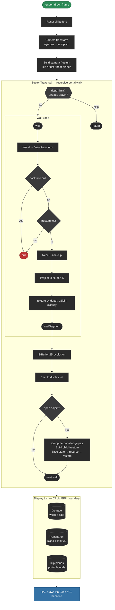

# q16 Engine

A feature-complete reimplementation of the **Jedi Engine** — the 2.5D portal engine behind *Star Wars: Dark Forces*™ (1995) — written from scratch in **pure C99**.

The goal: build the entire engine from the ground up based on reverse-engineered specifications, targeting **3dfx Glide on Windows 98** with real Voodoo hardware. No OpenGL, no DirectX, no modern abstractions. Just Glide, fixed-point math, and manual memory management.

This is an educational and entertainment project. A deep dive into C programming, retro 3D rendering, and the kind of engine architecture that powered mid-90s shooters before hardware-accelerated GPUs took over.

## Status

The CPU render pipeline is complete: portal-based sector traversal, frustum culling, wall clipping, S-buffer occlusion, lighting, display list generation, and object sorting. Full adjoin (portal) support allows seamless traversal between connected sectors.

Two working level renderers: a native **wireframe viewer** (SDL2 + OpenGL) and a cross-compiled **Glide 2.x renderer** (Win32 + 3dfx) that submits the display list as colored triangles. Both render full Dark Forces levels in real time — and also load *Outlaws*™ (1997) levels, since both games share the Jedi Engine's portal-based level format.

632 tests across 22 suites, all passing.

## Getting Started

Install dependencies on macOS:

```bash
brew install mingw-w64 cmake sdl2
```

The project uses [CMake Presets](https://cmake.org/cmake/help/latest/manual/cmake-presets.7.html). Two presets are available:

```bash
cmake --preset win32          # configure Win9x cross-build (MinGW i686)
cmake --build --preset win32  # → build-win32/q16_engine.exe

cmake --preset dev            # configure native dev build (macOS/Linux)
cmake --build --preset dev    # → build/q16_*
```

Native dev tools after building with `dev`:

```bash
./build/q16_tests    # 632 unit tests
./build/q16_view     # wireframe level viewer (SDL2 + OpenGL)
./build/q16_cli      # unified command-line inspector
```

To run `q16_engine.exe` you need Windows 95/98 with a 3dfx Voodoo card (or emulated via [86Box](https://86box.net/) / [PCem](https://pcem-emulator.co.uk/)), or [nGlide](https://www.zeus-software.com/downloads/nglide) on modern Windows.

## Target Platform

| Component | Target |
|---|---|
| OS | Windows 98 (Win32 API) |
| CPU | Pentium I / Pentium II (single-core x86) |
| GPU | 3dfx Voodoo (Glide 2.x) |
| RAM | 32–256 MB |
| Compiler | MinGW GCC (`i686-w64-mingw32-gcc`), C99 |

## Render Pipeline

Portal traversal and visibility are CPU-side. Walls, flats, and sprites are submitted as textured triangles to 3dfx Glide. The display list is the boundary between CPU geometry processing and GPU submission.



## Dev Tools

These tools run natively on macOS/Linux and are used for development, debugging, and visualization. None of them are part of the final Win32 target.

| Tool | Description |
|---|---|
| `q16_view` | **Wireframe level viewer.** SDL2 + OpenGL 3.3. Loads levels from GOB/LAB archives through the full CPU render pipeline and draws the display list output as colored wireframe quads. Three color modes (part type, sector ID, adjoin depth), WASD + mouse fly-camera, fullscreen 2D top-down minimap with visited-sector highlighting, adjustable max portal depth. |
| `q16_cli` | **Unified command-line inspector.** Archive listing, level geometry dumping, and struct size reporting — all in one tool. See [CLI Usage](#cli-usage) below. |
| `q16_engine` | **Glide 2.x level renderer.** Win32 cross-compiled target. Runtime DLL loading of `glide2x.dll`, fullscreen 640×480. Loads levels from LAB archives, runs the full CPU render pipeline, and draws the display list as colored Glide triangles. WASD + mouse fly-camera. |

### CLI Usage

`q16_cli` consolidates all command-line inspection into a single binary with subcommands. All arguments are mandatory — no defaults, no fallbacks.

**List archive contents** (works with both GOB and LAB formats):

```bash
./build/q16_cli archive mock/df/DARK.GOB
./build/q16_cli archive mock/ol/outlaws.lab
```

Prints every file entry with size, a summary with totals, and a breakdown by file extension.

**Inspect level geometry** (auto-detects .LEV / .LVT):

```bash
./build/q16_cli level mock/df/DARK.GOB SECBASE
./build/q16_cli level mock/ol/OLGEO.LAB HIDEOUT
```

Parses a level from an archive and dumps metadata (palette, music, parallax), texture list, and sector table with floor/ceiling heights, ambient light, wall counts, and flags.

**Print struct sizes**:

```bash
./build/q16_cli info
```

Reports the byte size of core engine structs (Sector, Wall, SecObject, LevelState) — useful for tracking memory layout changes during development.

### Wireframe Viewer

`q16_view` renders levels through the full CPU render pipeline and draws the display list as colored wireframe. Requires SDL2.

**Load a level from an archive** (auto-detects .LEV / .LVT):

```bash
./build/q16_view mock/df/DARK.GOB SECBASE
./build/q16_view mock/ol/OLGEO.LAB HIDEOUT
```

**Load a standalone level file** directly (no archive needed):

```bash
./build/q16_view path/to/SECBASE.LEV
```

The camera starts at sector 0's centre. Use the controls below to fly through the level.

> **Format note:** Sector and wall flag bits differ between Dark Forces (LEV) and Outlaws (LVT). The active format is selected at compile time via `ENGINE_FORMAT` in `src/game/world/flags.h`. A single build only interprets flags correctly for one format. Geometry renders fine either way, but flag-dependent behavior (sky/pit adjoins, passage blocking) will be wrong for the non-selected format.

#### Controls

| Key | Action |
|---|---|
| WASD | Move in XZ plane (relative to camera yaw) |
| Mouse | Look (yaw + pitch) |
| Space | Fly up |
| Ctrl | Fly down |
| C | Cycle color mode (part type / sector ID / adjoin depth) |
| PgUp / PgDn | Increase / decrease max portal depth |
| M | Toggle minimap overlay |
| L | One-frame portal trace (logged to console) |
| 1-7 | Toggle individual culling stages |
| 0 | Reset all culling stages to ON |
| Escape | Quit |

**Culling stage toggles** (keys 1-7) let you disable pipeline stages one at a time to see their effect on the rendered output:

| Key | Stage |
|---|---|
| 1 | Backface culling |
| 2 | Frustum testing |
| 3 | S-buffer occlusion |
| 4 | DFS sector marking |
| 5 | Portal budget limit |
| 6 | Frustum clipping |
| 7 | Portal frustum narrowing |

### Not Yet Implemented

- Asset file parsing (BM textures, WAX sprites, 3DO models, VOC sounds, PAL/CMP palettes) — data structures defined, loaders not yet written
- 8-bit to 16-bit texture conversion (565/1555)
- Textured Glide submission (walls, flats, sprites via `grDrawTriangle`) — untextured colored triangles working
- INF elevator / scripting system
- O file parsing (object placement)
- Collision detection and response
- Player controller and physics
- AI actor logic
- Projectile system
- Pickup / item system
- HUD and automap
- Audio (DirectSound / WinMM, VOC playback, iMuse MIDI)
- Save/load serialization

## Project Structure

```
src/
  game/
    types/          Fixed16, Vec2/Vec3, Angle14, forward declarations
    math/           Trig tables, core math, transforms
    memory/         Region, game memory
    util/           String utilities
    archive/        GOB + LAB unified read-only archive
    io/             StreamReader, TextParser tokenizer
    world/          Sector, wall, level, level parser, object, texture, model, flags
    render/         Camera, frustum, depth, window, lighting, S-buffer, wall processing,
                    flat tracking, adjoin system, display list, object sorting, sector traversal
    debug/          Debug visualization (color helpers) and structured logger
  tests/            Unit tests (test runner + 19 suites, 22 sub-suites)
  cli/              Unified command-line inspector (q16_cli)
  dev/              SDL2 + OpenGL wireframe level viewer (q16_view)
  win9x/            Win32 + Glide 2.x rendering target
lib/
  glad/             OpenGL loader (dev build only)
  glide2/           Glide 2.x API headers (3dfx.h, glide.h)
  glide2x.def       Glide 2.x import library definition
cmake/              MinGW cross-compilation toolchain
specs/              Reverse-engineered Jedi Engine specifications
ISSUES_LOG/         Known issues and root-cause analyses (in-repo tracker, no external tools)
```

## Trademarks

*Star Wars*, *Dark Forces*, *Outlaws*, and the Jedi Engine are trademarks or registered trademarks of Lucasfilm Ltd. and/or The Walt Disney Company. This project is not affiliated with or endorsed by Lucasfilm or Disney.

## Licence

GPLv3 with attribution clause. See [LICENCE](LICENCE).
